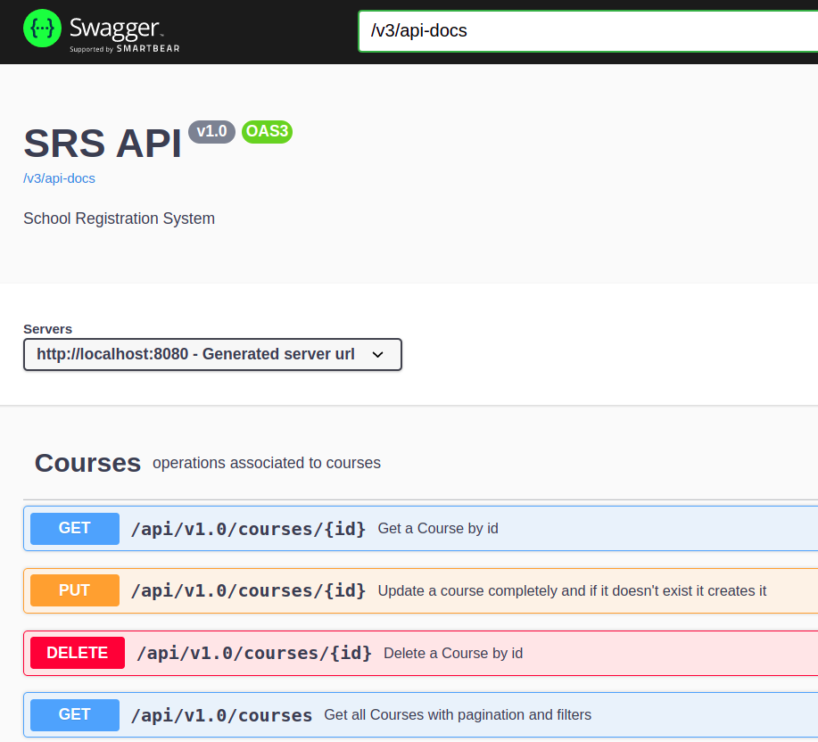
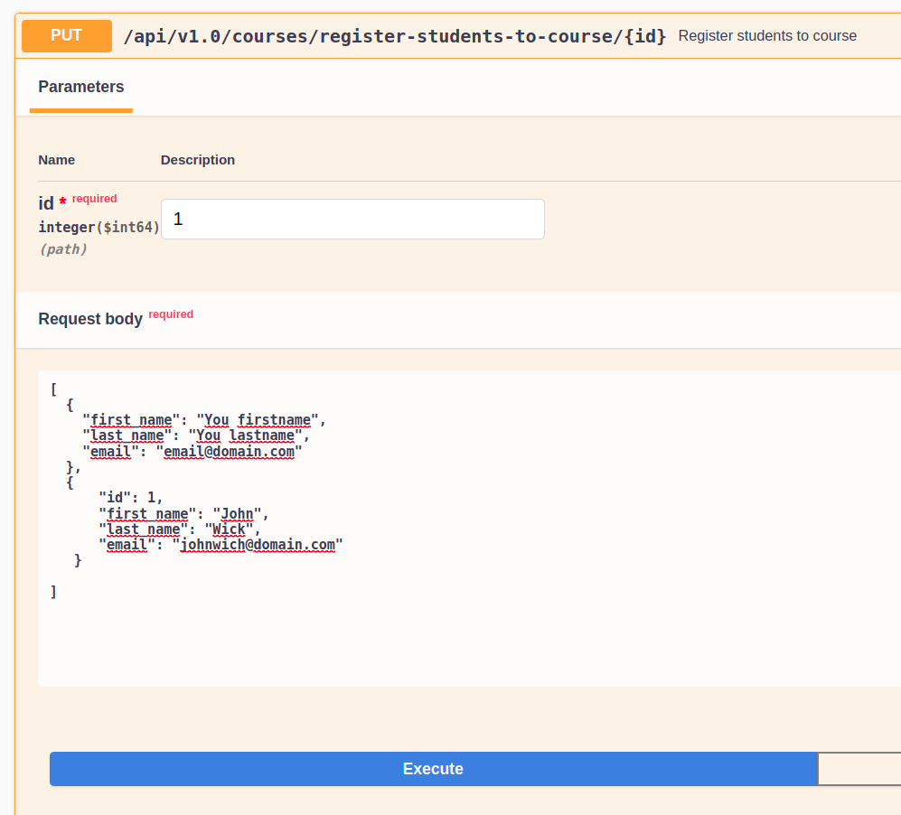

School registration system - [Metadata.io](https://metadata.io/) challenges
---
Design and implement simple school registration system
- Assuming you already have a list of students
- Assuming you already have a list of courses
- A student can register to multiple courses
- A course can have multiple students enrolled in it.
- A course has 50 students maximum
- A student can register to 5 course maximum

Provide the following REST API:
- Create students CRUD
- Create courses CRUD
- Create API for students to register to courses
- Create abilities for user to view all relationships between students and courses
+ Filter all students with a specific course
+ Filter all courses for a specific student
+ Filter all courses without any students
+ Filter all students without any courses


## Doc 📖️

### API Specification
[Swagger UI](http://localhost:8080/swagger-ui.html)

[Specification](http://localhost:8080/v3/api-docs/)



### Register student to course
The project run with mock data. You can see all courses and all students calling fetchAll operation of API REST of each resource.
To enroll student, must call the following operation:



e.g
```json
[
  {
    "first_name": "You firstname",
    "last_name": "You lastname",
    "email": "email@domain.com"
  },
  {
    "id": 1,
    "first_name": "John",
    "last_name": "Wick",
    "email": "johnwich@domain.com"
  }
]
```

### Search Specification

**Searching Without Filter and Sorting**

```json
{
    "filters": [],
    "sorts": [],
    "page": null,
    "size": null
}
```

If I mapping the operator translated to be a sql query like table below.

| Operator | SQL Query |
|---|---|
| EQUAL | `SELECT * FROM table WHERE field = ?` |
| NOT_EQUAL | `SELECT * FROM table WHERE field != ?` |
| LIKE | `SELECT * FROM table WHERE field LIKE '%?%'` |
| IN | `SELECT * FROM table WHERE field IN (?)` |
| BETWEEN | `SELECT * FROM table WHERE field >= ? AND field <= ?` |

If I mapping the sort direction translated to be a sql query like table below.

| Direction | SQL Query |
|---|---|
| ASC | `SELECT * FROM table ORDER BY field ASC` |
| DESC | `SELECT * FROM table ORDER BY field DESC` |


**Filter by Name and Sort by Release Date ASC**

Filter courses by name equal to Spanish

```json
{
    "filters": [
        {
            "key": "name",
            "operator": "EQUAL",
            "field_type": "STRING",
            "value": "Spanish"
        }
    ],
    "sorts": [
        {
            "key": "name",
            "direction": "ASC"
        }
    ],
    "page": 0,
    "size": 50
}
```

Filter courses by name not equal to Spanish

```json
{
    "filters": [
        {
            "key": "name",
            "operator": "NOT_EQUAL",
            "field_type": "STRING",
            "value": "Spanish"
        }
    ],
    "sorts": [
        {
            "key": "name",
            "direction": "ASC"
        }
    ],
    "page": 0,
    "size": 50
}
```

Filter courses by name not equal to CentOS and size 1 response

```json
{
    "filters": [
        {
            "key": "name",
            "operator": "NOT_EQUAL",
            "field_type": "STRING",
            "value": "Spanish"
        }
    ],
    "sorts": [
        {
            "key": "name",
            "direction": "ASC"
        }
    ],
    "page": 0,
    "size": 50
}
```

**Filter courses by name like and sort by release data DESC**

```json
{
    "filters": [
        {
            "key": "name",
            "operator": "LIKE",
            "field_type": "STRING",
            "value": "S"
        }
    ],
    "sorts": [
        {
            "key": "name",
            "direction": "DESC"
        }
    ],
    "page": 0,
    "size": 50
}
```


### Pre-requirements
* Java 11
* Docker

## Develop

  1) Run the docker-compose image to get MySQL and Adminer up.

    docker-compose -f src/main/docker/mysql.yml up -d

  2) Use the following access:

    url: http://localhost:8083/
    server: school-registration-mysql
    user: root
    pass: root
    db: schooldb

  3) Use flyway to restore the last version of DB domain

    mvn flyway:clean flyway:migrate -Dflyway.schemas=schooldb -Dflyway.user=root -Dflyway.password=root

  4) Run app

    mvn spring-boot:run

## Deploy 📦

Run the docker-compose of app.

    docker-compose -f src/main/docker/app.yml up -d

Go to Specification API [Swagger UI](http://localhost:8080/swagger-ui.html)

## Test ✏️

For the development and execution of the tests, I used the Spock framework. In this [repo](https://github.com/ewatemberg/acceptance-test-spock) there is information about a training about its use and its virtues in the readability of the tests and understanding (mainly in the use of the Gherkin language).

### Prepare the environment

  1) Run the docker-compose image to get MySQL and Adminer up.

    docker-compose -f src/main/docker/mysql.yml up -d

  3) Create the schema **schooldb_test**

  - You can use the following access to use adminer to manage the db from browser


    url: http://localhost:8083/
    server: school-registration-mysql
    user: root
    pass: root
    db: schooldb

  - Or you can use the following statement if you prefer use command line


    docker exec -it docker exec -it docker_school-registration-mysql_1 bash -l
    mysql -uroot -proot
    CREATE SCHEMA schooldb_test; GO

  3) Use flyway to restore the last version of DB domain

    mvn flyway:clean flyway:migrate -Dflyway.schemas=schooldb_test -Dflyway.user=root -Dflyway.password=root

  4) Run Test

    mvn test

### About TDD

You can find the **Unit Test** into **_src/test/groovy/com/example/app/_**     

### About ATDD

You can find the **Acceptance Test** into **_src/test/groovy/com/example/app/resource/atdd_**.

### Frameworks/Tools
* [Spring boot](https://spring.io/projects/spring-boot) - Framework de java
* [Spock](http://spockframework.org/) - Tests
* [Docker](https://www.docker.com/get-started/) - Containerized
* [Flyway](https://flywaydb.org/) - Version control for your database
* [Lombok](https://projectlombok.org/) 
* [Example Filter JPA Specification](https://github.com/piinalpin/springboot-jpa-specification)


## Notes 📋
(1) _It's recommended to use [IntelliJ Community](https://www.jetbrains.com/idea/download/) or [Eclipse IDE for Enterprise Java Developers](https://www.eclipse.org/downloads/packages/)_
